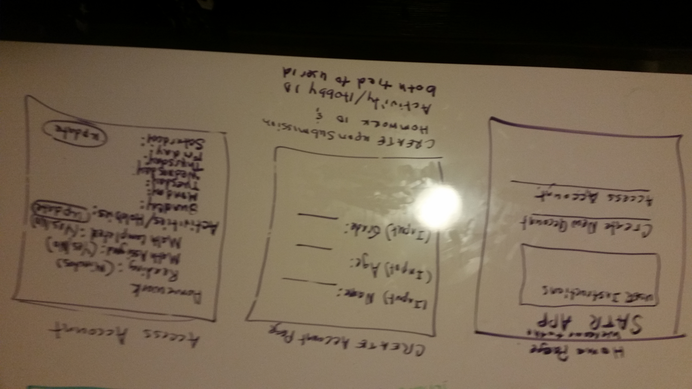
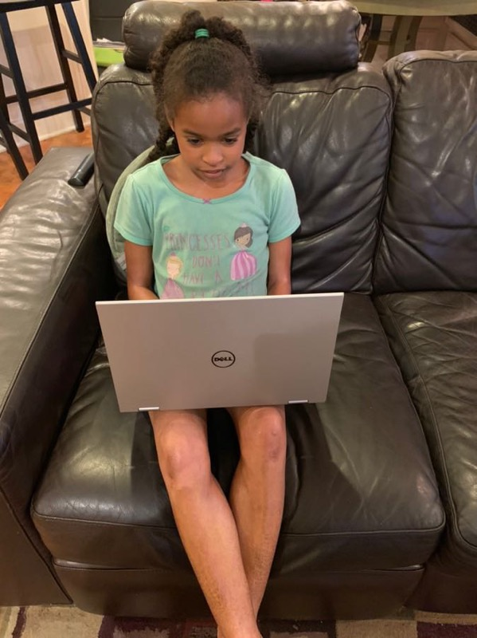

# Project-2: Building My First Full-stack Application

## Overview

For this project, I attempted to develop an application that could be used by elementary school sudents to keep track of their daily homework assignments and weekly extracurricular activities.  The goal was to develop an 'App' that would be easy to use, even for a 3rd grader.

**Live site:** <https://safe-mesa-73187.herokuapp.com/users>

## Technologies Used

* Languages - HTML5, CSS3, Javascript, MongoDB, Mongoose, Express, HandleBars & Node JS 
* Designed utilizing methodologies learned during initial weeks of GA's SEI 21 program 
* Project Planning & User Stories - [Trello](https://trello.com/invite/b/I2WZ2Cgw/5371d2a9465194d0db3620690150dde3/ga-sei-21-project-2)
* Text

## Wireframe

## WhiteBoard

 Editor - Visual Studio Code v.1.33.0

## Main Application Process & Related Details

The impetus for the development of Student Activities Tracker (SATR) App was the developer's real-life experiences with his 9 year-old daughter.  Over the course of the school year, any given week finds here involved in a multiple activities.  So the developer wanted to provide a tool she could utilize to track the completion status of her daily homework assignments and her weekly afterschool activities.

For the minimum viable product (MVP), the baseline assumes only homework assignment's typical of The ANC School's 3rd grade (located in Atlanta, GA). Users of the SATR App would be expected to input relevent details about their homework assignment(s) along with their afterschool activities. The model architecture for this App employs 3 schemas, identified as User, Homework, and Activities. 

This web application has been structured utilizing the Model-View-Controller (MVC) pattern. Best practices in terms of defining _RESTful_ routes were applied consistent with the REST (Representational State Transfer) guidelines. Full CRUD (Create, Read, Update & Delete) capability is provided for each of the three models indicated above. 

Pilot testing on the basic functions the MVP was performed with the aid of an actual 3rd grader.  The information gleaned from that experience will considered for future updates ot the MVP. 

## Features

* Utilizes Node.js along with ExpressJS to set up and configure a server that listens for HTTP requests from your browser.
* Server-side rendering of data (values) via Handlebars
* Mongoose, the object document mapping (ODM) library, is used to facilitate getting data in and out the nosql database MongoDB.

## Future Development

* Extend app use to cover multiple homework types assignments;
* Add date attributes to both homework and activities models;
* Add username and login features;
* Set conditions on model inputs to prevent empty values from being accepted (e.g., clicking the create button when no data values have been entered). 

